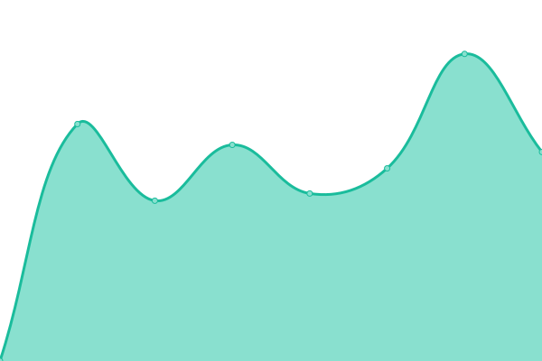
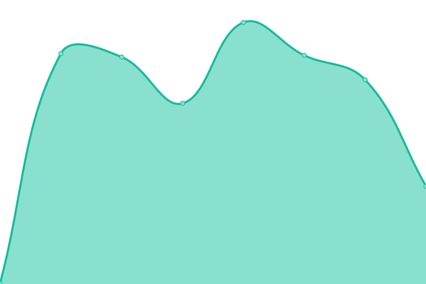

# [📈 Live Status](https://https://uptime.kovinda.eu.org/): <!--live status--> **🟧 Partial outage**

This repository contains the open-source uptime monitor and status page for [Kovinda Karunanayake](https://https://uptime.kovinda.eu.org/), powered by [Upptime](https://github.com/upptime/upptime).

With [Upptime](https://upptime.js.org), you can get your own unlimited and free uptime monitor and status page, powered entirely by a GitHub repository. We use [Issues](https://github.com/Kovinda/uptime/issues) as incident reports, [Actions](https://github.com/Kovinda/uptime/actions) as uptime monitors, and [Pages](https://https://uptime.kovinda.eu.org/) for the status page.

<!--start: status pages-->
<!-- This summary is generated by Upptime (https://github.com/upptime/upptime) -->
<!-- Do not edit this manually, your changes will be overwritten -->
<!-- prettier-ignore -->
| URL | Status | History | Response Time | Uptime |
| --- | ------ | ------- | ------------- | ------ |
|  [EKEL](https://ekel.kln.ac.lk/login/index.php) | 🟩 Up | [ekel.yml](https://github.com/Kovinda/uptime/commits/HEAD/history/ekel.yml) | 

 1547ms
     
 | 

<a href="https://uptime.kovinda.eu.org/history/ekel">99.66%</a>
    

|  [CAL](https://cal.kln.ac.lk/login/index.php) | 🟥 Down | [cal.yml](https://github.com/Kovinda/uptime/commits/HEAD/history/cal.yml) | 

 1503ms
     
 | 

<a href="https://uptime.kovinda.eu.org/history/cal">99.50%</a>
    

|  [KLN Medicine](https://medicine.kln.ac.lk/) | 🟩 Up | [kln-medicine.yml](https://github.com/Kovinda/uptime/commits/HEAD/history/kln-medicine.yml) | 

 2164ms
     
 | 

<a href="https://uptime.kovinda.eu.org/history/kln-medicine">100.00%</a>
    

|  [Kelaniya University](https://www.kln.ac.lk/) | 🟩 Up | [kelaniya-university.yml](https://github.com/Kovinda/uptime/commits/HEAD/history/kelaniya-university.yml) | 

 3430ms
     
 | 

<a href="https://uptime.kovinda.eu.org/history/kelaniya-university">100.00%</a>
    

<!--end: status pages-->

[**Visit our status website →**](https://https://uptime.kovinda.eu.org/)

## 📄 License

- Powered by: [Upptime](https://github.com/upptime/upptime)
- Code: [MIT](./LICENSE) © [Anand Chowdhary](https://anandchowdhary.com), supported by [Pabio](https://pabio.com)
- Data in the `./history` directory: [Open Database License](https://opendatacommons.org/licenses/odbl/1-0/)
